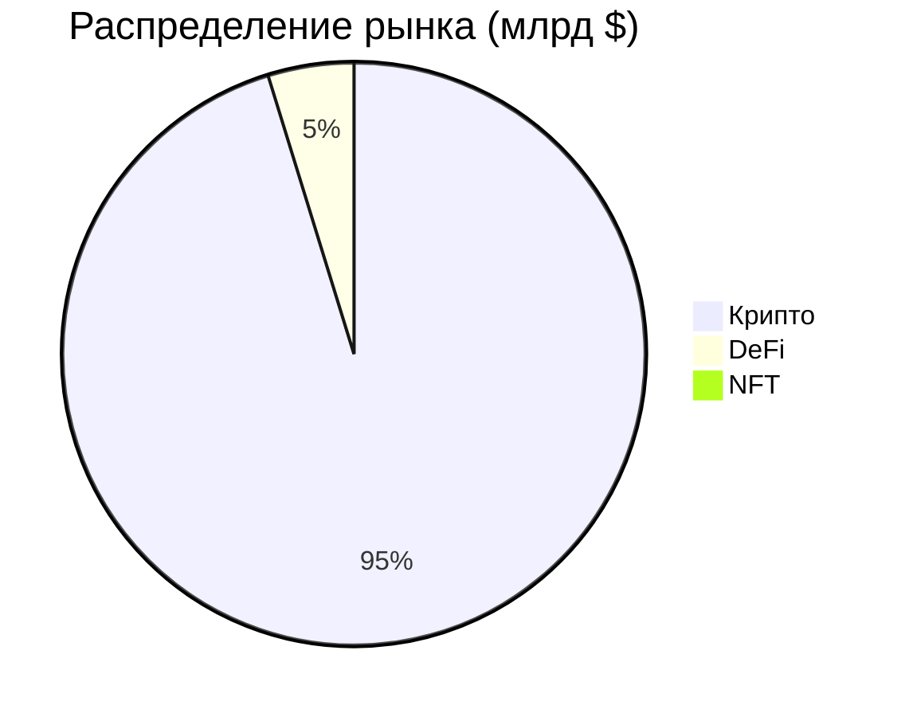

# Wealth Project - Анализ рынка

*Инновационный торговый терминал для Web3*

## 📋 Содержание
- [SWOT-анализ](#-swot-анализ)
- [Анализ потребителей](#-анализ-потребителей)
- [Анализ рынка](#-анализ-рынка)
- [Конкурентный анализ](#-конкурентный-анализ)

## 📊 SWOT-анализ

### 💪 Сильные стороны
| Категория | Описание | Метрика |
|-----------|----------|---------|
| Интеграция | CEX/DeFi в одном интерфейсе | Bybit + Uniswap |
| Аналитика | Julia для моделирования | 75% точность прогнозов |
| Платформа | Кроссплатформенность | Wails + React Native |
| Монетизация | Web3-контент | $5/месяц подписка |
| Автоматизация | Распределение прибыли | 20% на каждое направление |
| Безопасность | NFC + 2FA | Снижение рисков взлома |

### ⚠️ Слабые стороны
| Категория | Проблема | Решение |
|-----------|----------|---------|
| Разработка | Сложность интеграций | Аутсорсинг |
| Интерфейс | Перегруженность | Тестирование UX |
| Маркетинг | Ограниченный бюджет | Партнерства |
| API | Зависимость от внешних сервисов | Резервные системы |

### 🌟 Возможности
| Направление | Потенциал | Метрика |
|-------------|-----------|---------|
| DeFi | Рост рынка | TVL $100 млрд |
| Партнерства | Интеграции | Bybit, Uniswap |
| Контент | Монетизация | 100 подписчиков = $500 |
| Глобализация | Локализация | RU, EN, CN |

### ⚡ Угрозы
| Категория | Риск | Митигация |
|-----------|------|-----------|
| Регуляции | KYC/AML | Юридическая поддержка |
| Конкуренция | TradingView | Уникальные функции |
| Технологии | Сбои API | Тестирование |
| Рынок | Волатильность | Хеджирование |

## 👥 Анализ потребителей

### 🎯 Основные клиенты

#### Розничные трейдеры
- **Профиль:** 25-40 лет
- **Потребности:**
  - Единый интерфейс CEX/DeFi
  - Watch-лист с триггерами
  - Автоматическое распределение прибыли
- **UVP:** Торговля SOL за 5 минут

#### 💼 Профессиональные управляющие
- **Профиль:** Хедж-фонды
- **Потребности:**
  - Моделирование в Julia
  - API-интеграции
  - Индексы
- **UVP:** Снижение рисков на 15%

#### 📝 Контент-креаторы
- **Профиль:** Аналитики
- **Потребности:**
  - Web3-публикации
  - Монетизация
  - Переводы
- **UVP:** $500 от 100 подписчиков

#### 🔧 Технологические энтузиасты
- **Профиль:** Web3-участники
- **Потребности:**
  - DeFi + NFC
  - EVM-сети
  - Web3-функционал
- **UVP:** Безопасная торговля NFT

### 👀 Наблюдатели
| Группа | Роль | Потребности | Стратегия |
|--------|------|-------------|-----------|
| Регуляторы | Контроль KYC/AML | Прозрачность, соответствие законам | Опциональный KYC, документация |
| Биржи | API-партнеры | Стабильность, лимиты | Партнерства, тестирование |
| DeFi-разработчики | Инфраструктура | Корректное использование | Документация, сообщества |

### ❌ Потенциальные отказники
| Группа | Причина отказа | Решение | Результат |
|--------|----------------|---------|-----------|
| Консервативные инвесторы | Недоверие к DeFi | Упрощенный режим, гайды | Привлечение за 5 минут |
| Нетехнические пользователи | Сложность API/NFC | Интуитивный интерфейс | Настройка за 2 минуты |
| Конкуренты | Лояльность к TradingView | Уникальные функции | Привлечение 10% пользователей |

## 📈 Анализ рынка

### Размер рынка

### Ключевые метрики
- 💰 Крипторынок: $2 трлн
- 👥 Пользователи: 425 млн
- 🔒 DeFi TVL: $100 млрд
- 🎨 NFT: $10 млрд

### География
- 🌎 Северная Америка
- 🌍 Европа
- 🌏 Азия
- 🗺️ Россия и СНГ

## 🎯 Конкурентный анализ

### Прямые конкуренты
| Платформа | Сильные стороны | Слабые стороны |
|-----------|----------------|----------------|
| TradingView | Интерфейс, CEX | Нет DeFi, Julia |
| MetaTrader 5 | Алгоритмы | Сложность, нет DeFi |
| 3Commas | Автоматизация | Слабая аналитика |

### Косвенные конкуренты
| Платформа | Сильные стороны | Слабые стороны |
|-----------|----------------|----------------|
| Uniswap | Децентрализация | Нет CEX |
| Substack | Монетизация | Нет трейдинга |

---

*Последнее обновление: 2024*

 