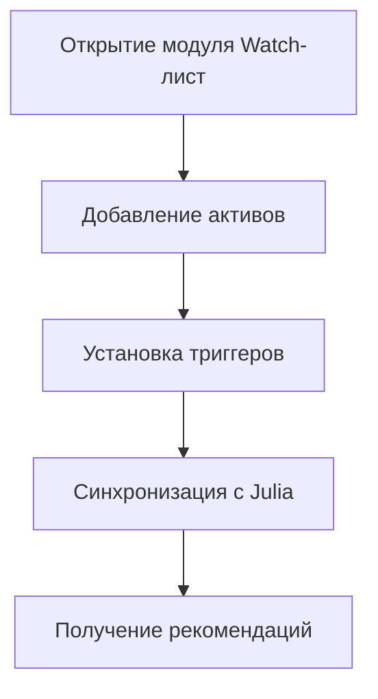

# Wealth Project - Торговый Терминал

## Содержание
- [1. Цель проекта](#1-цель-проекта)
  - [1.1. Миссия проекта](#11-миссия-проекта)
  - [1.2. Основные потребители](#12-основные-потребители)
  - [1.3. Основные риски](#13-основные-риски)
  - [1.4. Способы монетизации](#14-способы-монетизации)
  - [1.5. Для чего это нужно](#15-для-чего-это-нужно)
- [2. Пример использования](#2-пример-использования)
- [3. Анализ рынка](#3-анализ-рынка)
- [4. Функциональные требования](#4-функциональные-требования)
- [5. Технические требования](#5-технические-требования)
- [6. Этапы разработки MVP](#6-этапы-разработки-mvp)
- [7. Дополнительные требования](#7-дополнительные-требования)
- [8. Ограничения](#8-ограничения)
- [9. Критерии приемки](#9-критерии-приемки)
- [10. Управление заинтересованными сторонами](#10-управление-заинтересованными-сторонами)
- [11. Следующие шаги](#11-следующие-шаги)

## 1. Цель проекта

### 1.1. Миссия проекта

**Миссия:** Создать инновационный торговый терминал Wealth Project, объединяющий торговлю на централизованных (CEX) и децентрализованных (DeFi) биржах, управление портфелем, моделирование инвестиционных стратегий с использованием языка Julia и публикацию монетизируемого контента на блокчейне.

**Цели:**
- Разработать кроссплатформенный терминал (десктоп на Wails, мобильный на React Native)
- Обеспечить интеграцию с биржами (Bybit, OKX, Bitfinex) и DeFi-протоколами
- Реализовать инструменты для создания пользовательских криптоиндексов
- Создать систему публикации инвестиционных статей на блокчейне
- Поддержать управление портфелем с автоматическим распределением прибыли
- Обеспечить безопасность через NFC-подтверждения и 2FA

**Ключевая ценность:**
- Единый интерфейс для управления портфелями
- Автоматизация распределения прибыли
- Монетизация инвестиционных идей
- Поддержка прямого управления и моделирования

### 1.2. Основные потребители

#### 1.2.1. Основные клиенты

| Группа | Потребности | Пример |
|--------|-------------|---------|
| Розничные трейдеры | Удобный интерфейс, доступ к CEX и DeFi, аналитика | Инвесторы 25-40 лет |
| Профессиональные управляющие | Моделирование стратегий, API-интеграция | Хедж-фонды |
| Контент-креаторы | Платформа для публикации, монетизация | Блогеры, аналитики |
| Технологические энтузиасты | DeFi, блокчейн, NFC-безопасность | Участники Web3 |

#### 1.2.2. Наблюдатели

- **Регуляторы:** Контроль KYC/AML
- **Биржи:** Партнеры по API-интеграции
- **DeFi-протоколы:** Инфраструктура

### 1.3. Основные риски

#### Технические риски
- Нестабильность API бирж
- Ограничения Julia-сервера
- Задержки в DeFi

#### Рыночные риски
- Конкуренция
- Волатильность крипторынка

#### Регуляторные риски
- Ужесточение законов
- KYC требования

### 1.4. Способы монетизации

1. **Подписка на премиум-функции**
   - Расширенное моделирование
   - Увеличенные API-лимиты ($10-50/месяц)

2. **Комиссии за торговлю**
   - 0.1-0.5% от сделок
   - Реферальные комиссии

3. **Монетизация контента**
   - Подписка на статьи
   - Процент от инвестиций

4. **Продажа индексов**
   - Комиссия за доступ
   - Торговля индексами

## 2. Пример использования

### 2.1. Сценарий: Управление портфелем

**Целевой доход:** 20% годовых (~1.67% в месяц)

#### 2.1.1. Формирование watch-листа

#### 2.1.2. Распределение прибыли

| Направление | Процент | Пример |
|-------------|---------|---------|
| Вывод | 20% | $40 |
| Страховка | 20% | $40 |
| Долгосрочный | 20% | $40 |
| Среднесрочный | 20% | $40 |
| Кэшфлоу | 20% | $40 |

## 3. Анализ рынка

### 3.1. Размер рынка

- Крипторынок: $2 трлн
- DeFi: TVL ~$100 млрд
- NFT: ~$10 млрд

### 3.2. SWOT-анализ

#### Сильные стороны
- Интеграция CEX/DeFi
- Julia для моделирования
- Кроссплатформенность
- NFC, 2FA

#### Слабые стороны
- Сложность разработки
- Перегруженность интерфейса
- Ограниченный маркетинг

## 4. Функциональные требования

### 4.1. Торговый терминал
- Поддержка RVA, NFT, криптоактивов
- Лимитные/рыночные заявки
- Интеграция с блокчейнами

### 4.2. Безопасность
- NFC-подтверждение
- Шифрование
- 2FA

## 5. Технические требования

### 5.1. Основное приложение
- Backend: Go
- Frontend: Svelte/Vue.js
- Платформы: Windows, macOS, Linux

### 5.2. Мобильное приложение
- React Native
- iOS/Android

## 6. Этапы разработки MVP

1. Проектирование
2. Интеграция API
3. DeFi-торговля
4. Портфель и индексы
5. Публикация статей
6. Моделирование
7. Безопасность
8. Тестирование

## 7. Дополнительные требования

- Локализация (RU, EN, CN)
- Адаптивный дизайн
- API документация
- Техподдержка

## 8. Ограничения

- Бюджет на интеграцию
- Скорость транзакций
- API лимиты
- Производительность Julia

## 9. Критерии приемки

- [ ] Лимитная заявка в DeFi
- [ ] Отображение портфеля
- [ ] Создание индекса
- [ ] Публикация статей
- [ ] NFC-подтверждение
- [ ] Моделирование в Julia
- [ ] Распределение прибыли

## 10. Управление заинтересованными сторонами

| Группа | Влияние | Стратегия |
|--------|---------|-----------|
| Розничные трейдеры | Высокое | Бета-тестирование |
| Профессиональные управляющие | Среднее | Демо, вебинары |
| Контент-креаторы | Среднее | Инструменты публикации |
| Регуляторы | Высокое | Документация |
| Биржи | Высокое | Партнерства |

## 11. Следующие шаги

1. Разработка прототипа интерфейса
2. Тестирование Julia-сервера
3. Анализ конкурентов
4. План управления рисками

---

*Последнее обновление: 2024* 